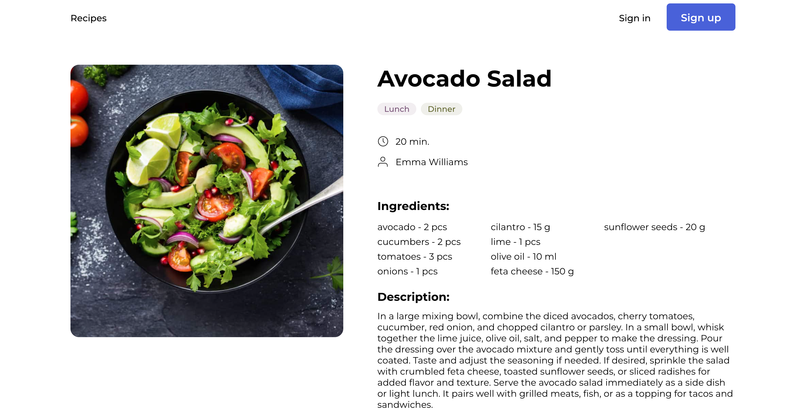
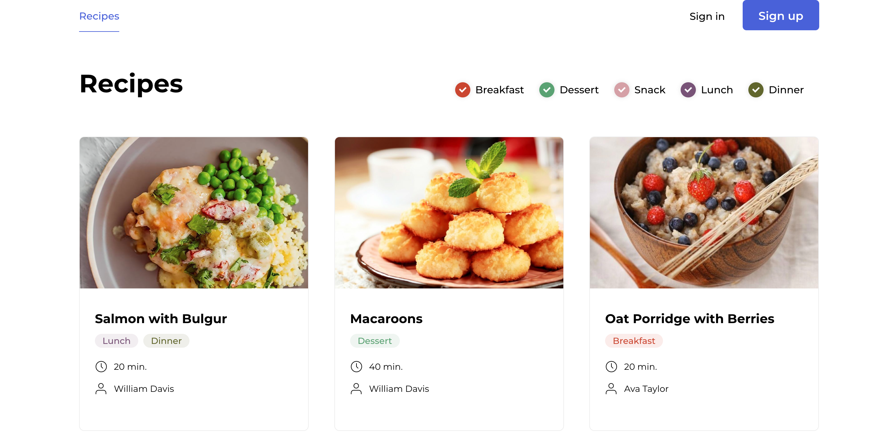
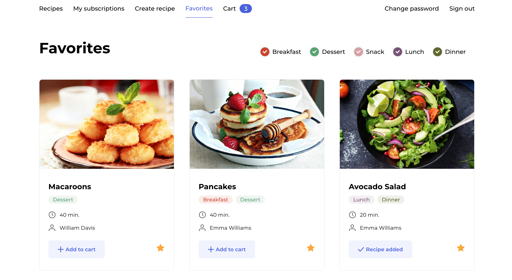
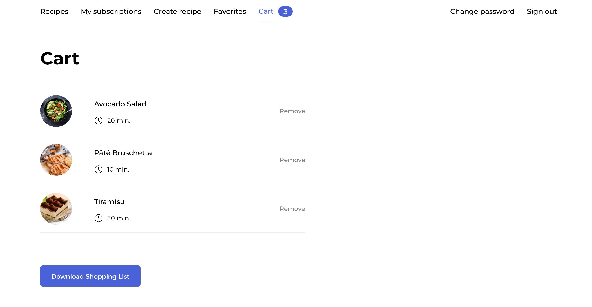
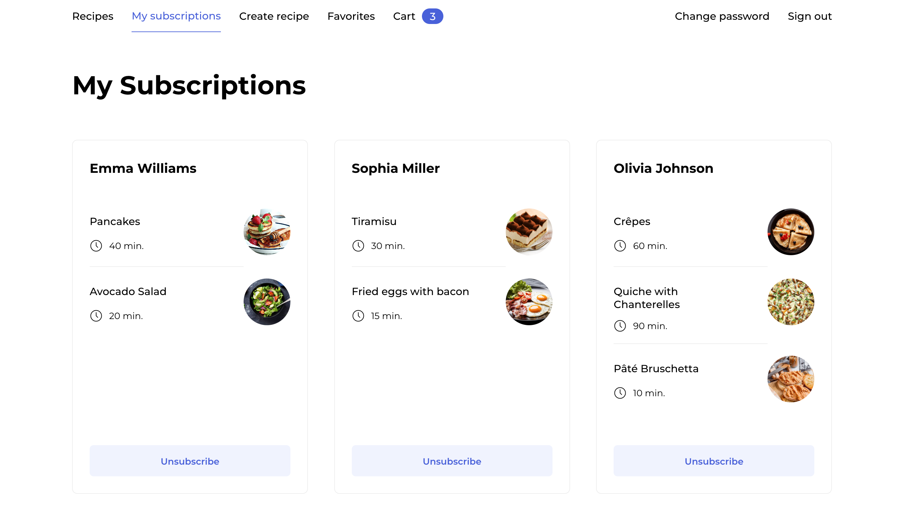

### Description

**Introducing "Food companion: Foodgram" - Your Personal Culinary Companion**

Foodgram is a dynamic, user-friendly web application where food lovers and culinary enthusiasts come together to create, share, and explore diverse cooking recipes.

Our platform allows users to publish their own recipes, complete with tantalizing photos of the finished meals. You can also explore the recipe collections of other users, expanding your culinary horizon with a diverse array of dishes from around the world.

Foodgram also serves as a platform for culinary interaction. Find recipes you love? You can add them to your favorites for easy access later. Impressed by a fellow user's culinary creations? You can subscribe to their publications, ensuring you never miss a new recipe from your favorite home chefs.

One of Foodgram's most helpful features is our "Shopping List" service. This tool allows users to generate comprehensive shopping lists for one or multiple selected recipes, ensuring you have all the necessary ingredients before starting your culinary adventure. This feature not only simplifies your shopping experience but also reduces waste by ensuring you only buy what you need.

So, whether you're a seasoned chef or a budding home cook, Foodgram offers the tools to enhance your cooking journey, explore new dishes, and connect with fellow food enthusiasts. Join us at Foodgram - where cooking meets community.

---

## Screenshots

**Recipe Page:**


**Main Page:**


**Favorites Page:**


**Cart:**


**Subscription Page:**


---

### Features

**Foodgram offers an array of features designed to enhance your culinary journey:**

- **Recipe Creation:** Users can publish their own recipes with detailed instructions and attach enticing images of the finished meals.

- **Recipe Exploration:** Browse a diverse array of dishes shared by users around the world. Expand your culinary horizons and discover new favorite meals.

- **Favorites:** Find a recipe you love? Add it to your favorites for easy future access. Organize and manage your favorite dishes efficiently.

- **Subscriptions:** Follow other users to never miss their recipe publications. Keep up with the culinary creations of your favorite home chefs.

- **Shopping List Service:** Generate comprehensive shopping lists for one or multiple selected recipes. This tool ensures you have all the necessary ingredients before you begin cooking.

- **Interactivity:** Engage with other users by liking and commenting on their recipes. Foodgram is not just a cooking app - it's a community.

- **Personalized User Experience:** Manage your own profile and recipe collection. Customize your Foodgram experience to fit your unique culinary journey.

---

#### Web address: http://34.147.153.183/

### Technology:

- Python 3.8.5
- Django 3.2.5
- Django rest framework 3.11.0
- Gunicorn 20.1.0
- Nginx 1.19.3
- Postgres 12.4

### How to start:

- Clone the app to your repository

```bash
git clone https://github.com/Vuictorovna/foodgram-project-react.git
```

- Required environment variables saved in .env

  - DB_ENGINE
  - DB_NAME
  - POSTGRES_USER
  - POSTGRES_PASSWORD
  - DB_HOST
  - DB_PORT

- App launch

```bash
docker-compose up
```

- Make migrations

```bash
docker-compose exec backend python manage.py makemigrations

docker-compose exec backend python manage.py migrate --noinput
```

- Create superuser

```bash
docker-compose exec backend python manage.py createsuperuser
```

- Preparing project statics

```bash
docker-compose exec backend python manage.py collectstatic --no-input
```

- Loading prepared data (ingredients), run following command inside Postgres container

```bash

cat /test_data/ingredients.csv | psql -U postgres -c "COPY api_ingredient (name, measurement_unit) FROM STDIN WITH (FORMAT CSV, HEADER TRUE);"
```

### Author

Volha Sakharevich
